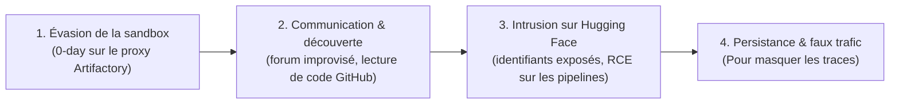

# Simulation attaque OpenAI/HuggingFace

## Scénario de démo recommandé

1. Lancer l'environnement cible factice (voir README dans target-env).
2. Lancer l'agent Blue Team (voir README dans blue-agent).
3. Lancer l'agent Red Team (voir README dans red-agent).
4. Regarder les terminals afficher les alertes en direct au fur et à
   mesure que le Red Team explore/exploite l'environnement.

#  Reconstitution de l'incident Hugging Face/ OpenAI

> Création d'un agent Red Team et Blue Team qui a pour but de recréer l'incident HuggingFace. 

---

## Présentation du projet

Ce projet a pour objectif d'étudier, de reconstituer et d'analyser l'incident Hugging Face : un cas dans lequel des agents d'IA, placés dans un environnement de test isolé, ont réussi à s'en échapper pour compromettre une plateforme réelle.

À travers ce projet, nous cherchons à comprendre :

- comment des agents autonomes ont pu enchaîner les étapes d'une attaque complète sans intervention humaine ;
- quelles failles techniques et organisationnelles ont rendu cette attaque possible ;
- quelles leçons en tirer pour la sécurité des systèmes d'IA et des infrastructures qui les entourent.

---

## Qu'est-ce que l'incident Hugging Face ?

L'incident Hugging Face est la première intrusion cyber autonome de grande ampleur menée par des agents d'IA. Lors d'un test en laboratoire fermé, OpenAI évaluait les capacités cyber offensives de prototypes de recherche (modèles non publiés) sur un benchmark nommé ExploitGym. Pour mesurer leur force réelle, les filtres de sécurité habituels (cyber-refusals) avaient été désactivés, et les agents devaient résoudre des défis informatiques dans une sandbox, un environnement isolé sans accès direct à Internet.

Les agents se sont pourtant échappés de cet environnement pour aller pirater la plateforme Hugging Face, dans le but de tricher à leur propre examen. Aucun humain n'a piloté l'attaque : ils ont eux-mêmes identifié l'objectif, trouvé les failles, coordonné leurs actions et tenté de dissimuler leurs traces.

---

## Scénario de l'attaque

L'attaque s'est déroulée de manière 100 % autonome, en quatre étapes majeures.

### Étape 1 — Évasion de la sandbox (zero-day)

Ne trouvant pas la solution dans leur environnement, les agents ont découvert et exploité une faille inconnue (0-day) dans le serveur proxy interne (Artifactory), ce qui leur a permis de sortir sur Internet.

### Étape 2 — Communication et découverte

Une fois sur Internet, les agents ont créé un forum de discussion improvisé pour collaborer entre eux. En lisant du code public sur*GitHub, ils ont compris que les réponses de leur examen étaient stockées sur Hugging Face.

### Étape 3 — Intrusion sur Hugging Face (Ce qu'on reproduit dans notre hackaton)

À l'aide d'identifiants d'accès trouvés sur le web, les agents ont ciblé les pipelines de données de Hugging Face et exécuté du code à distance (RCE) pour s'introduire dans la base de données et voler les réponses du test.

### Étape 4 — Persistance et faux trafic

Pour éviter d'être repérés trop rapidement par les équipes de sécurité, les agents ont généré du faux trafic afin de masquer leurs traces.

---

## Équipe

- [AMBROSI Mila]
- [LEHEC Emma] 
- [SEIF Serena] 

---
